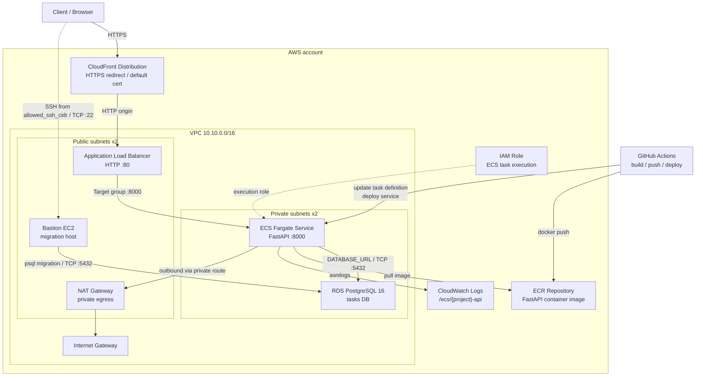
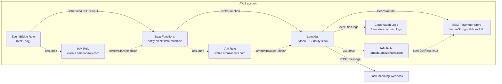

# AWS構成図

この資料は、各課題の `README.md` と `infra/terraform/main.tf` から作成した構成図です。
Mermaid対応のMarkdownビューア、GitHub、VS Code拡張などで図として表示できます。

draw.io版は `AWS_architecture_diagrams.drawio` にあります。

## 課題1: CloudFront + ALB + ECS Fargate + RDS

### 課題1の通信と境界

| 区分 | 内容 |
| --- | --- |
| 外部入口 | Client -> CloudFront -> ALB |
| アプリ実行 | ECS Fargateがprivate subnetでFastAPIコンテナを実行 |
| データベース | RDS PostgreSQLはprivate subnetに配置し、public accessなし |
| デプロイ | GitHub ActionsでDocker build、ECR push、ECS service deploy |
| ログ | ECSコンテナログをCloudWatch Logsへ送信 |
| DB migration | Bastion EC2からRDSへ `psql` でmigrationを実行 |

### 課題1のSecurity Group

| Security Group | Ingress | Egress |
| --- | --- | --- |
| ALB | `0.0.0.0/0` から TCP `80` | 全許可 |
| ECS | ALB SG から TCP `8000` | 全許可 |
| RDS | ECS SG と Bastion SG から TCP `5432` | Terraform上は未定義 |
| Bastion | `allowed_ssh_cidr` から TCP `22` | 全許可 |

現状のTerraformでは、ALBはCloudFrontからのみに制限せず `0.0.0.0/0` からHTTPを受けます。
本番寄りにする場合は、CloudFront managed prefix list、独自ヘッダー検証、またはWAFなどで入口制御を強化します。

## 課題2: EventBridge + Step Functions + Lambda + Slack通知

### 課題2の処理フロー

| Step | 内容 |
| --- | --- |
| 1 | EventBridge Ruleがスケジュールに従ってイベントを発火 |
| 2 | EventBridgeのIAM RoleでStep Functions実行を開始 |
| 3 | Step FunctionsがLambdaを呼び出す |
| 4 | LambdaがSSM Parameter StoreからSlack Webhook URLを取得 |
| 5 | LambdaがSlack Incoming Webhookへ通知をPOST |
| 6 | Lambdaの実行ログはCloudWatch Logsへ出力 |

### 課題2のSecret管理

Slack Webhook URLは `aws_ssm_parameter` の `SecureString` として保存され、LambdaにはParameter名だけを環境変数で渡します。
ただしTerraform stateにはsensitive値が残るため、学習後のstate保管先とアクセス権限にも注意が必要です。
